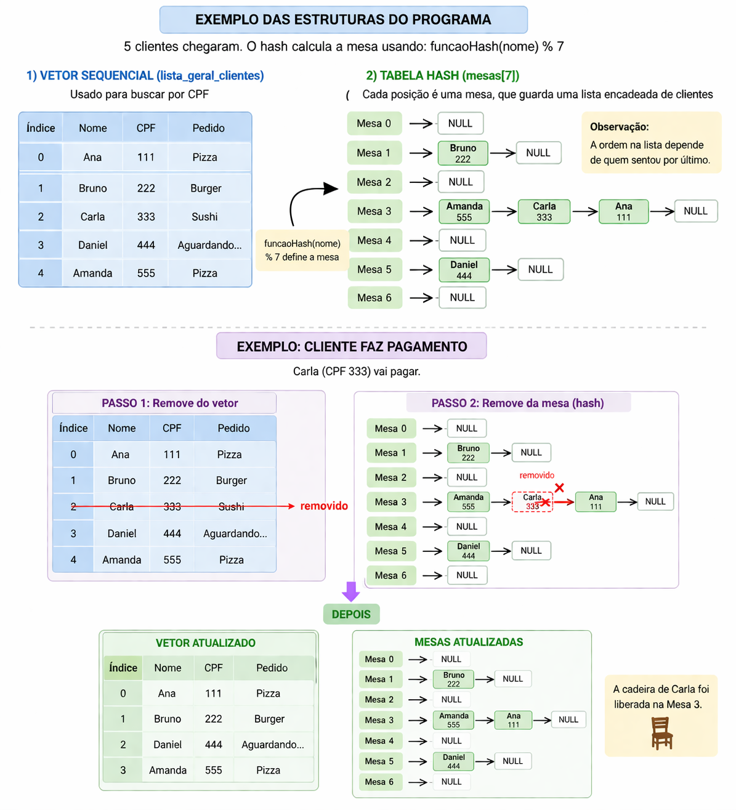
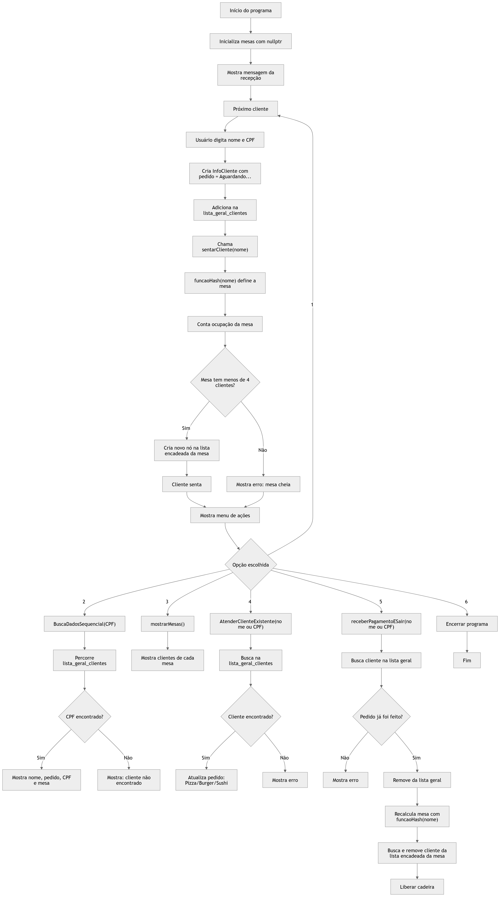

# G9_Busca_EDA2_2026.1
## Alunos
|Matrícula | Aluno |
| -- | -- |
| 22/1031111  | Anne de Capdeville   |
| 22/2021890  | Manuella Magalhães Valadares |

## Sobre
Este projeto simula a recepcao de um restaurante usando estruturas de dados:

- tabela hash para distribuir clientes nas mesas
- lista encadeada para representar as cadeiras ocupadas em cada mesa
- vetor para manter os dados gerais dos clientes

O sistema permite cadastrar clientes, registrar pedidos, buscar por CPF, visualizar mesas e receber pagamento com validacao de regra de negocio.

## Funcionalidades
- Cadastrar cliente com nome e CPF
- Alocar cliente em mesa com funcao hash
- Limite de 4 clientes por mesa
- Buscar dados do cliente por CPF
- Atender cliente por nome ou CPF e atualizar pedido
- Receber pagamento por nome ou CPF
- Bloquear pagamento de cliente sem pedido realizado
- Liberar cadeira da mesa e remover cliente da lista geral apos pagamento
- Mostrar mensagens destacadas no terminal com cores ANSI

## Pré-requisitos
- Compilador C++ com suporte a C++11 ou superior (exemplo: g++)
- Terminal (PowerShell no Windows)

## Instalação
1. Clone ou baixe o repositorio
2. Entre na pasta do projeto
3. Compile o programa
4. Execute o binario gerado

## Fluxo rapido

## Regras importantes
- Digitar sair no campo Nome encerra o programa
- A tabela possui 7 mesas (numero primo)
- A funcao hash atual usa soma de caracteres modulo NUM_MESAS
- Dados sao mantidos apenas em memoria durante a execucao

